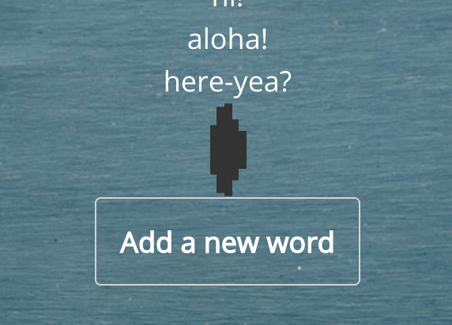

# String Store

### The String Store is a basic application that records and displays all of the strings added to the database.

## To Run

1. Fork this repository
2. Navigate to this directory in your terminal
3. Run `bundle install` and `npm install` in your terminal
4. Ensure your local database is up and running. I used Postgres.
5. Run `rails db:setup` in your terminal.
6. Navigate to `localhost:3000/words` in your terminal.
7. Enjoy creating new strings!

## Overview

This Single-Page, RESTful application has two UI: one to display the stored words, and another to add stored words to the list.

## Features

* User add strings to word index

* User view all strings in the index

* Loading spinner

* Unit testing
* User navigation between two pages
* Intentional styling so as to highlight features and functionality

## Technologies and Libraries

* React Router
    * Ensures UI is in sync with the URL.
* Redux
    * This framework defines how the frontend of the application communicates with the API served from the backend.
* Redux Saga
    * This middleware enables the application to make asynchronous calls easier to manage.
* Jest/Enzyme
    * Unit testing framework.
* jQuery - AJAX
    * Application leverages AJAX functionality to load data in the background without reloading the whole page.
* Ruby on Rails
    * The backend of this application is housed by Rails.
* Postgres
    * In development, this application utilizes Postgres as its database.

## Technical Challenges

* Unit test of form container
    * In order to create the shallow copy needed for unit testing in jest/enzyme, the `WordForm` class needs to be exported as a function. This enables enzyme's `shallow()` function to create a wrapper that can be used in unit testing.

    `const wrapper = shallow(<WordForm />);`

* Implementing new libraries
    * Redux Saga is a new library. Due to the fact that Saga manages a somewhat hard-to-envision data type, the `Promise`, Saga itself is hard conceptualize

* Serving API as an array from backend
    * In order to display the index of strings to the index page, I preferred the backend serve the list of `Word.content` as an array of strings. Manipulating jBuilder's `json.array!` functionality solved this
    problem.

* Importing jQuery
    * This library was deemed necessary as String Store's functionality is very basic; thus, it will not lose substantial UI/UX speed in the process.

## Future

- [ ] Full, end-to-end testing
- [ ] Delete string functionality
- [ ] Update index display

## Requirements
Using React Boilerplate, create an application. (Expected to take 6-10 hours). Upon completion, respond to this email with a link to your GitHub fork of the React Boilerplate repo.

* One page shall have UI to input a string which saves to a database of your choice.
* One page shall display all strings stored on the database.
* User shall be able to navigate between the two pages.
* The application need not be fully styled but should be laid out in a meaningful way. No need to deploy the application.

## Libraries
The application must leverage:
* React Router
* Redux
* Redux Saga
* Reselect
* Styled Components - Use at least one styled component. The component must have a prop passed in for conditional rendering.
* Unit Tests - Write tests for one container. Full test coverage is not required.
